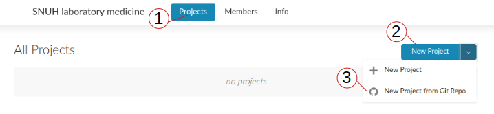

# lecture-snuhlab

R lecture: 서울대병원 진단검사의학과

## 목표

의학연구에서 **[R](https://www.r-project.org/)** 활용 능력을 대략 5단계로 구분할 수 있다.

> 1. 데이터 정리는 미리 excel로 완료, 통계분석만 R 이용.
> 2. R로 데이터 정리와 통계분석을 모두 수행.
> 3. R로 그림도 그린다.
> 4. 논문에 들어갈 Table과 figure를 모두 R로 만든다.
> 5. 글쓰기, 참고문헌 등 논문의 모든 작업을 R에서 직접 수행한다.

본 강의는 2, 3단계를 탄탄히 하고 4,5 단계를 맛보는 정도에 해당한다. 선생님들의 바쁜 일정을 감안, 예습/복습 필요없이 모든 강의 내용을 그 시간에 실습하고 끝낼 예정이다.

## 강사 이력 

이름: [김진섭](https://jinseob2kim.github.io/resume/)

소속: 연구지원 법인 [차라투](https://www.zarathu.com) 대표

학력: 성균관의대 졸업, [서울대학교 보건대학원](http://snugepi.snu.ac.kr/) 박사 수료.
      
주요 경력: 예방의학 전문의(서울대 보건대학원), 책임연구원(삼성전자 무선사업부)

## 일정 

|회차| 일시  | 주제  |
|---|---|---|
|1| 4월 2일(목) 11-13시  | R 데이터 매니지먼트 [기초](https://blog.zarathu.com/posts/2020-02-16-rdatamanagement-basic)  |
|2|  4월 14일(화) 11-13시 |  R 데이터 매니지먼트 최근: [tidyverse](https://blog.zarathu.com/posts/2019-01-03-rdatamanagement/) |
|3|  4월 28일(화) 11-13시 | R 데이터 시각화: [ggplot2](https://evamaerey.github.io/ggplot_flipbook/ggplot_flipbook_xaringan.html)  |
|4|  5월 12일(화) 11-13시 | [의학연구에서의 기술통계](https://blog.zarathu.com/posts/2018-11-24-basic-biostatistics/)  |
|5|  5월 26일(화) 11-13시 | 회귀분석, 생존분석  |
|6|  6월 9일(화) 11-13시 | R로 논문쓰기: [rmarkdown](https://blog.zarathu.com/posts/2019-01-03-rmarkdown/) |

## 준비사항 

실습은 클라우드 환경인 [RStudio cloud](https://rstudio.cloud) 를 이용하여 진행한다. 회원가입 후, 아래를 따라 강의자료가 포함된 실습환경을 생성하자.

> 1. https://rstudio.cloud 회원 가입

> 2. https://rstudio.cloud/spaces/53975/join?access_code=kuFNlbt%2FbSj6DH%2FuppMdXzvU4e1EPrQNgNsFAQBf 들어가서 __*"Join Space"*__ 클릭

> 3. 위쪽 __*"Projects"*__ 클릭 후, __*"New Project"*__ 를 눌러 __*"New Project from Git Repo"*__ 를 선택 후, Repo 주소 **https://github.com/jinseob2kim/lecture-snuhlab** 입력.

개인 PC에서 실습을 원한다면 http://www.r-project.org 와 https://rstudio.com/products/rstudio/download/#download 에서 **[R](https://www.r-project.org/)** 과 **[RStudio](https://rstudio.com/)** 를 설치하자.
